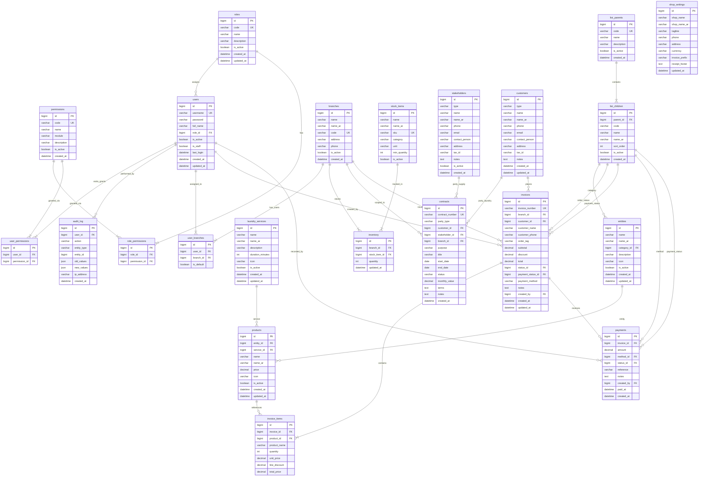

# AquaWash — Database ERD

Full entity-relationship diagram for the Django backend (MySQL).

## Apps

| App | Tables |
|-----|--------|
| **rbac** | users, roles, permissions, role_permissions, user_permissions |
| **common** | list_parents, list_children, shop_settings, audit_log |
| **catalog** | entities, laundry_services, products |
| **operations** | branches, user_branches, stock_items, inventory, stakeholders, contracts |
| **sales** | customers, invoices, invoice_items, payments |

## Not stored in DB

- **Cart** — browser memory only
- **Auth sessions / JWT** — Django (same `users` table as `AUTH_USER_MODEL`)

## Export as image

1. Open [mermaid.live](https://mermaid.live)
2. Paste contents of `aquawash-erd.mmd`
3. Export → PNG, SVG, or PDF

## Diagram

## list_parents seed examples

| parent `code` | example children |
|---------------|------------------|
| `invoice_status` | pending, completed, cancelled |
| `payment_status` | unpaid, partial, paid, refunded |
| `payment_method` | cash, card, transfer |
| `entity_category` | traditional, casual, linen |

## Key cross-app links

| From | To | Purpose |
|------|----|---------|
| `users` | `user_branches` → `branches` | Branch access per user |
| `invoices` | `branches` | Which branch issued the sale |
| `contracts` | `customers` or `stakeholders` | Party depends on `party_type` |
| `contracts` | `branches` | Contract scoped to a branch |
| `inventory` | `branches` + `stock_items` | Stock levels per branch |
